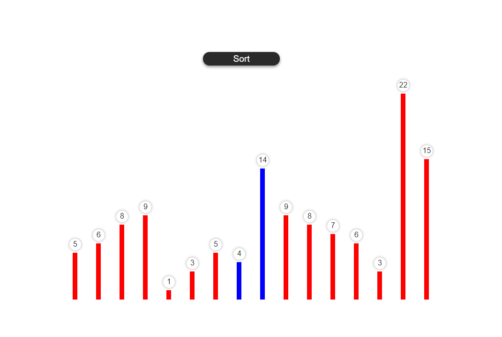

### Bubble Sort is used in this case . But ofcourse more types of sorting can be implemented like this.

Demo Link:

### Image Preview

### I believe in opensource.
So any pull requests with the bug fixing and new feature will be appreciated. Thanks.